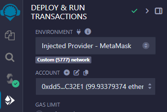
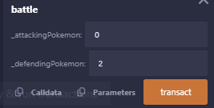
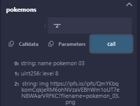

## NFT Pokemon - Curso Blockchain DIO

Repositório de Smart Contract de criação de NFTs de pokemons e execução de batalhas para o curso Blockchain DIO.

### Código do Smart Contract do PokeDIO
[PokeDIO.sol](contracts/PokeDIO.sol)

### Personagens

Foram criados 4 personagens pokemons na PokeDIO e enviados para a blockchain do IPFS:

| pokemon 01   | pokemon 02 | pokemon 03   | pokemon 04  |
|:--------:|:--------:|:--------:|:--------:|
|  |  |  |  |

## Execução

A execução dos testes deu-se em ambiente REMIX com deploy do contrato

Realização da batalha entre os pokemons

Visualização dos níveis de cada Pokemon

## Tecnologias
* SOLIDITY
* REMIX
* GANACHE
* IPFS
* METAMASK WALLET